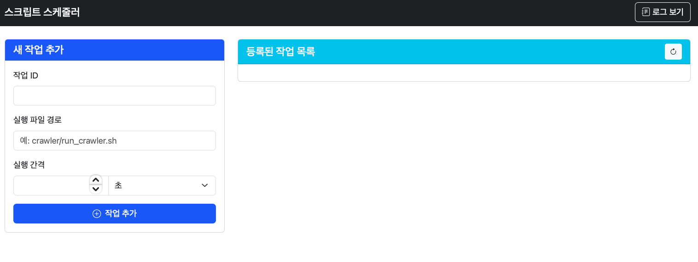

# Python Script Scheduler - 파이썬 자동 실행 스케줄러 🎯


A web-based scheduler application for automated Python script execution.

## 📸 Screenshot



## Key Features

- 💻 Script scheduling through web interface
- ⏰ Flexible execution intervals (seconds/minutes/hours)
- 📝 Real-time log monitoring
- 🔄 Running job management (view/modify/delete)
- 🗄️ SQLite-based job storage

## Technology Stack

- **Backend**: FastAPI
- **Scheduler**: APScheduler
- **Database**: SQLite
- **Frontend**: Static HTML/JavaScript
- **Documentation**: OpenAPI (Swagger)

## Requirements

- Python 3.8+
- pip (Python package manager)
- Virtual environment (recommended)

## Installation

1. Clone the repository
```bash
git clone [repository-url]
cd autorun
```

2. Create and activate virtual environment
```bash
python -m venv venv
source venv/bin/activate  # Linux/Mac
# or
.\venv\Scripts\activate  # Windows
```

3. Install dependencies
```bash
pip install -r requirements.txt
```

## Usage

1. Run the application
```bash
./run_scheduler.sh
# or
python app.py
```

2. Access via web browser
```
http://localhost:8000
```

## macOS Auto-start Configuration

### LaunchAgent Setup

1. Create LaunchAgents directory
```bash
mkdir -p ~/Library/LaunchAgents
```

2. Create plist file
```bash
nano ~/Library/LaunchAgents/com.scheduler.plist
```

3. Write plist file content
```xml
<?xml version="1.0" encoding="UTF-8"?>
<!DOCTYPE plist PUBLIC "-//Apple//DTD PLIST 1.0//EN" "http://www.apple.com/DTDs/PropertyList-1.0.dtd">
<plist version="1.0">
<dict>
    <key>Label</key>
    <string>com.scheduler</string>
    <key>ProgramArguments</key>
    <array>
        <string>/bin/bash</string>
        <string>/Users/[username]/workspace/autorun/run_scheduler.sh</string>
    </array>
    <key>RunAtLoad</key>
    <true/>
    <key>KeepAlive</key>
    <true/>
    <key>StandardErrorPath</key>
    <string>/Users/[username]/workspace/autorun/logs/error.log</string>
    <key>StandardOutPath</key>
    <string>/Users/[username]/workspace/autorun/logs/output.log</string>
    <key>WorkingDirectory</key>
    <string>/Users/[username]/workspace/autorun</string>
    <key>EnvironmentVariables</key>
    <dict>
        <key>PATH</key>
        <string>/usr/local/bin:/usr/bin:/bin:/usr/sbin:/sbin</string>
    </dict>
</dict>
</plist>
```

4. Setup execution script
```bash
# Create script
nano ~/workspace/autorun/run_scheduler.sh

# Script content
#!/bin/bash
export PATH="/usr/local/bin:/usr/bin:/bin:/usr/sbin:/sbin"
cd /Users/[username]/workspace/autorun
source venv/bin/activate
python3 app.py
```

5. Set permissions
```bash
chmod +x ~/workspace/autorun/run_scheduler.sh
sudo chown [username]:staff ~/Library/LaunchAgents/com.scheduler.plist
sudo chmod 644 ~/Library/LaunchAgents/com.scheduler.plist
```

### Service Management

Start service:
```bash
launchctl load ~/Library/LaunchAgents/com.scheduler.plist
launchctl start com.scheduler
```

Stop service:
```bash
launchctl stop com.scheduler
launchctl unload ~/Library/LaunchAgents/com.scheduler.plist
```

Check service status:
```bash
launchctl list | grep scheduler
```

### Log Monitoring

```bash
# Check real-time output logs
tail -f ~/workspace/autorun/logs/output.log

# Check real-time error logs
tail -f ~/workspace/autorun/logs/error.log
```

## API Endpoints

| Endpoint | Method | Description |
|----------|--------|-------------|
| `/api/jobs` | GET | Retrieve all scheduled jobs |
| `/api/jobs` | POST | Create a new job |
| `/api/jobs/{job_id}` | GET | Get specific job details |
| `/api/jobs/{job_id}` | PUT | Update job settings |
| `/api/jobs/{job_id}` | DELETE | Delete a job |
| `/api/logs` | GET | Retrieve system logs |

## Project Structure

```
autorun/
├── app.py              # FastAPI application main
├── requirements.txt    # Project dependencies
├── run_scheduler.sh    # Execution script
├── scripts/           
│   ├── init.py
│   └── run_script.py   # Script execution handler
├── static/
│   └── index.html      # Web interface
└── logs/               # Log directory
```

## Environment Variables

You can create a `.env` file to set the following environment variables:

- `PORT`: Server port (default: 8000)
- `LOG_LEVEL`: Logging level (default: INFO)
- `DATABASE_URL`: Database URL (default: sqlite:///jobs.sqlite)


## Logging
- Log file: `logs/output.log`
- Error log file: `logs/error.log`
## Start Service
- launchctl load ~/Library/LaunchAgents/com.scheduler.plist
## Stop Service
- launchctl unload ~/Library/LaunchAgents/com.scheduler.plist
## Check Service Status
- launchctl list | grep scheduler
## Check Logs
- tail -f ~/workspace/autorun/logs/output.log
- tail -f ~/workspace/autorun/logs/error.log

---
### Download Files from Git Repository
Use when downloading files from GitHub:
```bash
# 1. Clone project from GitHub
git clone https://github.com/lhg96/autorun.git
# 2. Pull files from remote repository
git pull origin main
```


## 📞 문의하기

[](mailto:hyun.lim@okkorea.net)
[](https://www.okkorea.net)

개발 관련 컨설팅 및 외주 받습니다.

프로젝트 관리자 연락처:
- name: 임현근 (Hyun-Keun Lim)
- Email: hyun.lim@okkorea.net
- homepage: https://www.okkorea.net

---
